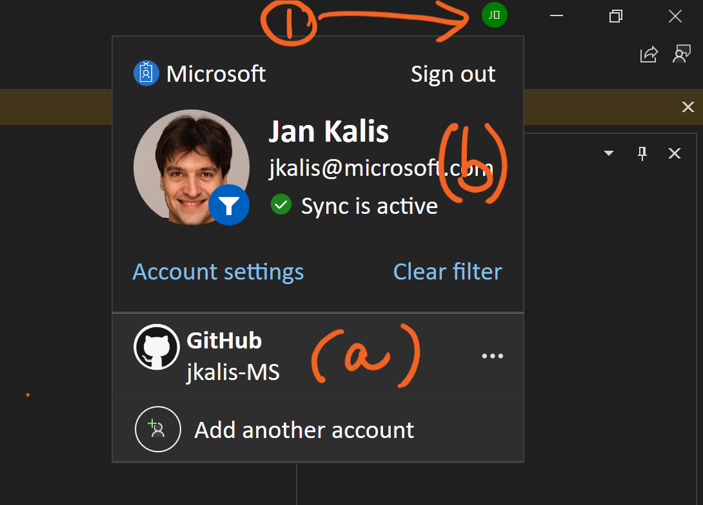

# Code Optimizations extension (preview) for Visual Studio 

1. [PREREQUISITES](#Prerequisites)
2. [INSTALLATION](#Installation)
3. [USAGE](#Usage)

# Prerequisites 
## GitHub Account
For the extension to work, we need your GitHub account to meet the following criteria:
1.	**Copilot subscription.** If you don’t have it, this page explains how you can get it for free: [Copilot organization | Microsoft Open Source Management](https://repos.opensource.microsoft.com/orgs/MicrosoftCopilot).
2.	**Public association within the [Copilot-Code-Optimizations](https://github.com/copilot-code-optimizations) organiztion on GitHub.** We did invite you to this organization, good news you have accepted membership - and you can read these instructions. There is one more thing to validate - your membership in this organization needs to be public (if it's not the extension will not be able to connect to the LLM backend and generate a code fix). A quick way to verify that is to search for your GitHub username within the members list and see if the affiliation is public, as indicated in the screenshot. 

- [Members · People · copilot-code-optimizations (github.com)](https://github.com/orgs/copilot-code-optimizations/people)

## Application Insights Code Optimizations
1. Make sure Azure Application Insights and Application Insights Profiler is enabled for your .NET apps. If not, follow these instructions [Application Insights](https://learn.microsoft.com/en-us/azure/azure-monitor/app/create-workspace-resource?tabs=bicep) and [Application Insights Profiler](https://learn.microsoft.com/en-us/azure/azure-monitor/profiler/profiler).
2. Validate that Code Optimizations are identified for your application - go into the **Performance** blade of your Application Insights resource and click on “**Code Optimizations**” as shown below

3. Please note (a) the Application Insights resource name, (b) the account that you are using to sign into Azure portal.

## Visual Studio and GitHub Copilot Chat
1.	Current versions of extensions were tested with Visual Studio 17.9, 17.10 and 17.11. If you are using a different version of Visual Studio and the extension is not working, please let us know
2.	Open Visual Studio and ensure you are signed in with (a) your GitHub account and (b) the account that you used to access Azure portal. You can validate on the top right corner of Visual Studio. If one account is missing, add it. Without both accounts added the current version of the Code Optimizations extension will not be able to work correctly. 

3. Open GitHub Copiulot chat using menu command **View -> GitHub Copilot Chat**. If it's not available and you are using Visual Studio 17.9 or older, please make sure you have installed the GitHub Copilot Chat extension using **Extensions -> Manage Extensions...**

# Add Code Optimizations (preview) feed into the extensions gallery 
1. Launch Visual Studio
3. Open Options dialog using **Tools-> Options...** command, then select **Extensions**
4. Add a new feed named "Code Optimizations" with the URL "https://salmon-coast-03fbc8d1e.5.azurestaticapps.net/feed.xml"
    
6. Click **Apply** and **OK** to close the Options dialog.

# Install the Code Optimizations (preview) extension
1. Now we can install the extension from the **Extensions -> Manage Extensions...**
2. Find the Code Optimizations category under **Visual Studio Marketplace** category
  
3. If you are using the New Extension Manager "UI Refresh" you will find the category in ... -> Browsing Location -> Code Optimizations
    
4. Install the version that matches your Visual Studio version
   
# Usage 

### Visual Studio Extension

1. Open the repo you have insights for in Code Optimizations.
2. Open GitHub Copilot Chat
3. The Code Optimizations (preview) extension introduces an "agent" called `@code_optimizations` with a few commands or *skills* that let you interface with Code Optimizations issues. To invoke the extension,  type `@code_optimizations` followed by the skill and the necessary parameters:

#### @code_optimizations /connect <Application_Insights_Resource_Name>

The command will pull the top issues from Code Optimizations, map them to source code in your local repo and try suggesting fixes / recommendations. It automatically will display the first fix it's able to offer. To generate fixes for other issues, follow the instructions in the Copilot response.

# Feedback
Your feedback is important to us! If you have any questions or suggestions, please reach out to our email alias: codeoptimizations@microsoft.com or open an issue in this repo.

## Trademarks

This project may contain trademarks or logos for projects, products, or services. Authorized use of Microsoft 
trademarks or logos is subject to and must follow 
[Microsoft's Trademark & Brand Guidelines](https://www.microsoft.com/en-us/legal/intellectualproperty/trademarks/usage/general).
Use of Microsoft trademarks or logos in modified versions of this project must not cause confusion or imply Microsoft sponsorship.
Any use of third-party trademarks or logos are subject to those third-party's policies.
